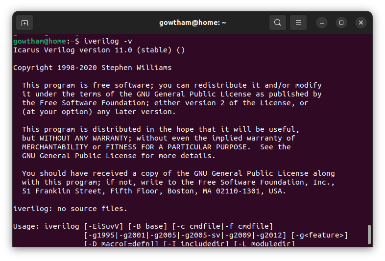
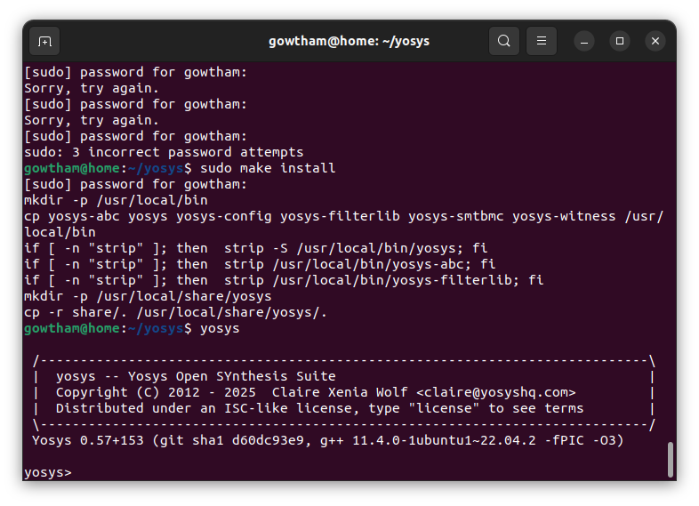

# Week-0_RISC-V_Tapeout
## Summary:
The diagram essentially breaks down the flow of designing a System on Chip (SoC) in digital VLSI. The process begins with modeling and defining chip specifications in C, where you also write testbenches to verify the logic (stage O1). Then, you move on to the RTL (Register Transfer Level) design phase (O2), where hardware is created using Verilog. This includes designing individual components like processors, peripherals, and IPs (Intellectual Properties), which are then synthesized to create gate-level netlists.

The third stage (O3) is about integrating all these components into one cohesive SoC. Here, all the building blocks like the processor and GPIOs are combined into a complete chip architecture. Once the design is integrated, physical design steps follow—floorplanning, placement, clock tree synthesis, and routing—ensuring everything fits and works well together on the chip. Additionally, IP libraries and hardened macros are used to optimize and refine the design.

Lastly, signoff checks like DRC (Design Rule Check) and LVS (Layout Versus Schematic) ensure the design’s correctness, and the final GDSII file is generated. This file is what goes for actual fabrication of the chip.

In short, this process takes a chip from the initial idea (C model) all the way through to its physical realization (GDSII for fabrication).

## Project Screenshots

### Iverilog
Icarus Verilog is an open-source Verilog simulator that compiles and executes digital designs. It helps verify RTL code by running simulations and generating results, aiding debugging with tools like GTKWave.

### GTKWave
GTKWave is an open-source waveform viewer used for analyzing simulation output. It visualizes signal activity, helping engineers debug and verify designs by displaying waveform data from simulators like Icarus Verilog.

### Yosys
Yosys is an open-source RTL synthesis tool that converts Verilog code into gate-level netlists. It supports various optimizations and integrates with different design flows, making it ideal for ASIC and FPGA design.

